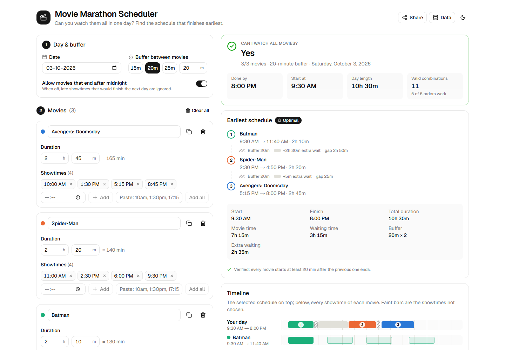
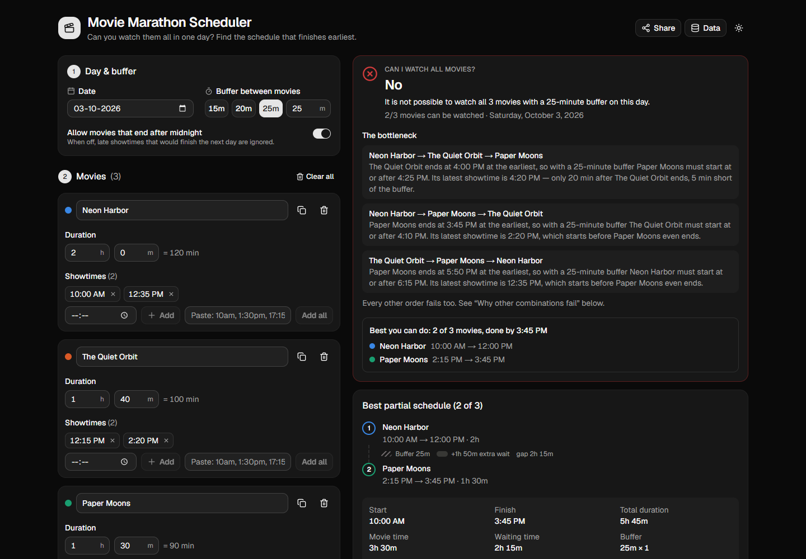
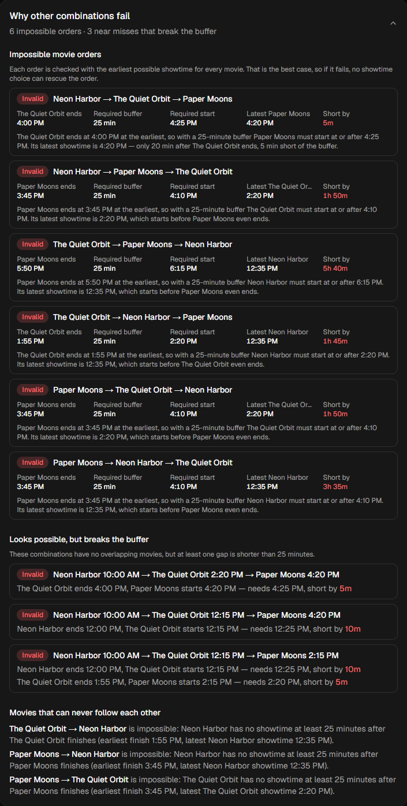
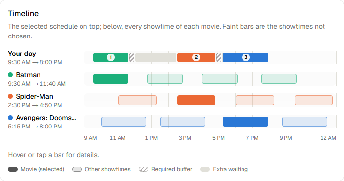
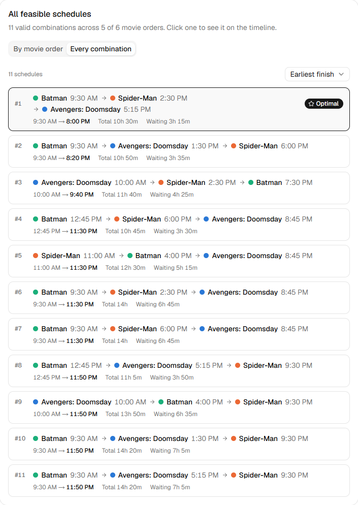
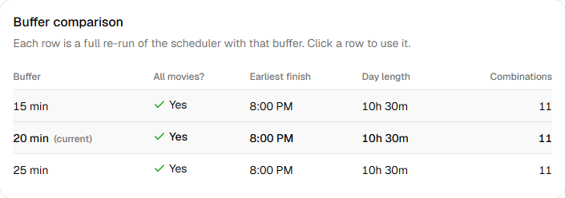
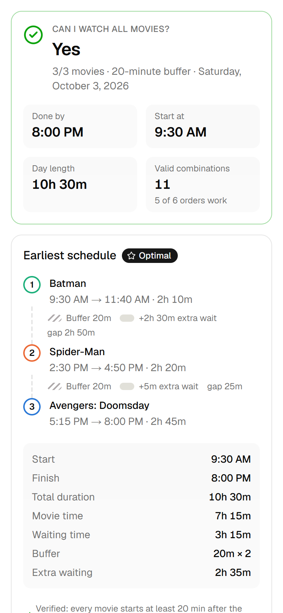

# 🎬 Movie Marathon Scheduler

**Can you watch all the movies you want in a single day? If so, what is the schedule that finishes earliest?**

Enter the movies you want to see, their durations and every showtime on the day, choose a buffer between movies, and the app works out:

- whether **all** requested movies fit into one day,
- the schedule that **finishes earliest** (which movie first, which showtime for each),
- **every other feasible** order and showtime combination,
- **why** each impossible combination fails, down to the minute.

**Live app:** https://movie-marathon-scheduler.vercel.app



---

## Features

| | |
|---|---|
| **Instant verdict** | "Yes / No" with movie count, buffer, finish time and the number of valid combinations. |
| **Earliest schedule** | Step-by-step plan with each buffer and any extra waiting, plus start, finish, total duration, movie time, waiting time, buffer (`20m × 2`) and extra waiting. Each schedule is re-checked against the buffer rule before it is shown. |
| **All feasible schedules** | Grouped *by movie order* (best showtimes per order, plus how many showtime combinations work), or *every combination*, sortable by earliest finish, earliest start, lowest waiting or shortest total time. The optimum is marked. Click any schedule to inspect it. |
| **Why combinations fail** | For every impossible order: which movie can't be placed, when the previous one ends, the required start, the latest showtime and how many minutes short it is. Also lists **near misses**: combinations with no overlaps that still break the buffer. |
| **Bottleneck explanation** | When nothing works: pairs of movies that can never share the day, the failing orders, and the **best partial schedule** (the most movies you *can* fit). |
| **Timeline** | Gantt view: your day (movie / required buffer / extra waiting) above one row per movie showing every showtime, so you can see why the chosen showtimes were picked. Responsive, works in light and dark mode. |
| **Buffer comparison** | 15 / 20 / 25 min (plus your custom value) re-solved by the real engine: feasible?, earliest finish, day length, combinations. |
| **Fast input** | Add and remove movies, duplicate a movie, add a showtime with a time picker or paste several at once (`10am, 1:30 PM, 17:15`), clear all, plus four demo datasets. |
| **Validation** | Empty names, zero durations, missing or invalid showtimes, duplicate showtimes (ignored with a warning), duplicate names, negative buffers, and movies that run past midnight (allowed and marked `(+1)`, or rejected with the toggle off). |
| **Persistence & sharing** | Auto-saves to `localStorage`, with Save / Load / Reset. **Share** puts the movies, durations, showtimes, buffer and selected schedule into the URL hash, so no database is needed. |

<table>
<tr>
<td width="50%"></td>
<td width="50%"></td>
</tr>
<tr>
<td></td>
<td></td>
</tr>
<tr>
<td></td>
<td align="center"></td>
</tr>
</table>

## Tech stack

- **Next.js 16** (App Router) · **React 19** · **TypeScript**
- **Tailwind CSS v4** · **shadcn/ui** (Base UI primitives) · lucide icons · next-themes
- **Vitest** for the engine test suite
- **Vercel** for hosting, **GitHub Actions** CI (lint, typecheck, tests, build)

Everything runs in the browser. The page is statically prerendered and there is no backend or database.

---

## Why this is a scheduling / constraint-optimisation problem

A schedule is a choice of **order** for the movies *and* a **showtime** for each one, subject to a hard constraint between consecutive movies:

```
next.start  ≥  previous.start + previous.duration + buffer
```

and an objective: **minimise the finish time of the last movie**.

Sorting by start time is not enough. The earliest showtime of the day can be a trap: taking it may push every other movie into late showtimes (see the *"Earliest start is a trap"* demo, where starting at 9:00 finishes 90 minutes later than starting at 10:00). The search space is `N! × Π(showtimes per movie)`. For 6 movies with 60 showtimes each, that is about 3.4 × 10¹³ combinations, so blind brute force is not an option. This is a small instance of single-machine scheduling with time windows (no preemption, setup time = buffer, minimise makespan).

## The algorithm

All engine code is in [`src/lib/scheduler`](src/lib/scheduler). It is pure TypeScript with no React or browser APIs:

```
src/lib/scheduler/
├── types.ts         data model (Movie, Schedule, SolveResult, …)
├── time.ts          parsing/formatting, binary search helpers
├── validation.ts    input validation + validateSchedule (the buffer rule)
├── scoring.ts       schedule metrics + comparators (the objective)
├── permutations.ts  permutation generator, per-order analysis, pair analysis
├── scheduler.ts     solve(): DP, branch-and-bound search, best subset, near misses
└── __tests__/       Vitest suite
```

Times are integers: minutes after midnight on the selected day, with values ≥ 1440 meaning after midnight.

### 1. The key observation

Once some set of movies has been watched, the only thing that matters for the rest of the day is **when the last one ended**. So the search state is

```
(set of movies still to watch, end time of the previous movie)
```

and the set can be stored as a bitmask. The previous end time only ever takes values that are real movie end times, so there are at most `2^N × (total showtimes)` states.

### 2. Earliest finish: memoised DP

```
F(remaining, prevEnd) = min over movies j in remaining of
                        F(remaining − j, s_j + duration_j)
    where s_j = the earliest showtime of j that is ≥ prevEnd + buffer   (binary search)
F(∅, prevEnd) = prevEnd
```

Picking the **earliest** valid showtime of the next movie is always at least as good as picking a later one, because ending earlier never removes options for later movies (exchange argument). If `F` is ∞ for the full set, watching everything is impossible.

### 3. Exact counting

`C(remaining, prevEnd)` counts every valid (order, showtime) assignment with the same memoisation, so the app can say "11 valid combinations" exactly without listing them all.

### 4. Enumerating schedules: DFS + branch and bound

All feasible schedules are listed by depth-first search over (movie, showtime) choices, pruned with `F`:

- **Feasibility pruning:** a branch is cut as soon as `F` says the remaining movies cannot fit, so the search **never walks into dead ends**. Every node it visits leads to at least one valid schedule.
- **Bound pruning:** the search keeps the best *K* schedules (default 500) in a max-heap. A branch is cut when even its best possible finish is later than the current *K*-th best, or equal to it but with more waiting.
- Children are visited best bound first, so the bound tightens quickly.

The result is the **exact top-K schedules by earliest finish**, plus the exact total count, without generating the Cartesian product. In the 6 × 60 showtime test it explores a few thousand nodes instead of 3.4 × 10¹³ combinations.

### 5. Per-order analysis (why an order fails)

For each of the N! orders (shown up to 8 movies):

1. **Greedy forward:** take the earliest valid showtime for each movie in turn. This gives the order's earliest finish *T*. If some movie has no valid showtime, **no assignment exists for this order**, because greedy is the best case. The point of failure is the real bottleneck, reported with the previous end, required start, latest showtime and minutes short.
2. **Backward pass:** take the latest showtime of each movie that still finishes by *T*. This gives the latest possible start, which means the least waiting.
3. **Forward again from that start:** the final tie-break (earliest showtimes).

The number of showtime combinations for an order is counted in `O(N·S)` with prefix sums.

### 6. When nothing fits

- **Pair analysis:** `A → B` is impossible if `A`'s earliest end + buffer is after `B`'s latest showtime. If both directions are impossible, the two movies can never share the day.
- **Best subset:** forward bitmask DP `best[mask]` = earliest end of a schedule covering exactly `mask`. The answer is the largest feasible mask (earliest finish on ties).
- **Near misses:** a separate search with a 0-minute buffer finds combinations that do not overlap but break the real buffer, closest misses first.

### Objective and tie-breaking

1. **Earliest finish of the last movie**: the primary goal.
2. **Least waiting.** For complete schedules the total movie time is fixed, so for an equal finish, *least waiting = shortest day = latest start = least extra waiting beyond the buffer*. These secondary criteria all agree. "Earliest start" would mean *more* waiting for the same finish, so it is offered as a sort option but not used as the objective.
3. Earliest showtimes, compared movie by movie, then a stable id.

### Limits

Up to **10 movies** (2¹⁰ subsets) and any number of showtimes per movie. Per-order listings are shown up to 8 movies (8! = 40,320 orders). Beyond that, the "every combination" view still works because it is searched with pruning.

---

## Example

Input (the *Textbook A/B/C* demo), buffer 20 minutes:

| Movie | Duration | Showtimes |
|---|---|---|
| A | 120 min | 10:00, 15:00 |
| B | 100 min | 12:30, 17:30 |
| C | 90 min | 15:00, 20:00 |

Output:

```
ALL MOVIES CAN BE WATCHED ✓   3/3 movies · 20-minute buffer

Optimal schedule
1. A   10:00 AM → 12:00 PM      buffer 20m, +10m extra wait
2. B   12:30 PM →  2:10 PM      buffer 20m, +30m extra wait
3. C    3:00 PM →  4:30 PM
Start 10:00 AM · Finish 4:30 PM · Total 6h 30m · Movie time 5h 10m · Waiting 1h 20m

All feasible schedules (6 combinations across 3 of 6 orders), by earliest finish
#1  A 10:00 AM → B 12:30 PM → C 3:00 PM    finish 4:30 PM   waiting 1h 20m   ★ optimal
#2  A 10:00 AM → C 3:00 PM  → B 5:30 PM    finish 7:10 PM   waiting 4h
#3  A 3:00 PM  → B 5:30 PM  → C 8:00 PM    finish 9:30 PM   waiting 1h 20m
#4  B 12:30 PM → A 3:00 PM  → C 8:00 PM    finish 9:30 PM   waiting 3h 50m
#5  A 10:00 AM → B 12:30 PM → C 8:00 PM    finish 9:30 PM   waiting 6h 20m
#6  A 10:00 AM → B 5:30 PM  → C 8:00 PM    finish 9:30 PM   waiting 6h 20m

Impossible orders
B → C → A   C ends 4:30 PM → A must start ≥ 4:50 PM, latest A is 3:00 PM (starts before C ends)
C → A → B   C ends 4:30 PM → A must start ≥ 4:50 PM, latest A is 3:00 PM
C → B → A   B ends 7:10 PM → A must start ≥ 7:30 PM, latest A is 3:00 PM
```

The *Tight buffer* demo shows the buffer comparison at work:

| Buffer | All movies possible? | Earliest finish |
|---|---|---|
| 15 min | Yes | 3:45 PM |
| 20 min | Yes | 5:50 PM |
| 25 min | No (2/3) | — |

---

## Getting started

Requirements: Node.js 20.9+ (CI uses Node 24).

```bash
git clone https://github.com/Aarjav-333/movie-marathon-scheduler.git
cd movie-marathon-scheduler
npm install
npm run dev          # http://localhost:3000
```

| Script | What it does |
|---|---|
| `npm run dev` | Development server |
| `npm run build` / `npm start` | Production build / serve it |
| `npm test` | Run the scheduling-engine test suite once |
| `npm run test:watch` | Tests in watch mode |
| `npm run lint` | ESLint |
| `npm run typecheck` | Generate Next.js route types + `tsc --noEmit` |

## Testing

```bash
npm test
```

The suite in [`src/lib/scheduler/__tests__/scheduler.test.ts`](src/lib/scheduler/__tests__/scheduler.test.ts) covers:

1. Two movies with an obvious valid schedule (with every metric checked)
2. Two movies where the buffer alone makes it impossible (exact violation reported, appears as a near miss)
3. Three movies with multiple valid permutations (6 combinations across 3 orders, per-order counts)
4. Multiple showtimes per movie (the spec's Avengers / Spider-Man / Batman data, hand-verified optimum)
5. Different buffer values, including the exact boundary `start == end + buffer`
6. A case where the earliest-starting movie is **not** the right first movie
7. No feasible schedule (blocked pairs, best partial schedule, largest subset)
8. Equal finishing times with different waiting times (least waiting wins)
9. Duplicate showtimes (de-duplicated, warned, not double-counted)
10. Large inputs: 6 movies × 60 showtimes (≈3.4 × 10¹³ brute-force combinations) solved with a bounded number of search nodes, and 10 movies

It also includes a **randomised cross-check**: 1,000 random instances (plus 60 with 5 movies) are solved by the engine and by an independent, deliberately naive brute force (every permutation × every showtime combination). Feasibility, exact counts, the top-K ordering, the optimum, per-order results and the best-subset size must all match.

## Deployment

The app is deployed on **Vercel** (link at the top of this README).

### Automatic deploys, gated by CI

The GitHub repository is connected to the Vercel project:

```text
push to main ──► Vercel builds a production deployment ──► waits for the GitHub "test-and-build" check
                                                                 │
                                       CI passes ──► promoted to the production domain
                                       CI fails  ──► stays unpromoted; production keeps serving the previous version
```

- Every push to `main` creates a production build, and pull requests get preview URLs.
- A **Vercel Deployment Check** requires the `test-and-build` job from [`.github/workflows/ci.yml`](.github/workflows/ci.yml) (lint, typecheck, tests, build) to pass before a build is assigned to the production domain. A commit that breaks the scheduler is built but never goes live.
- If you rename that job, update the Deployment Check (**Project → Settings → Build and Deployment → Deployment Checks**) to match, because checks are matched by job name.
- No environment variables are needed.

### Setting it up for a fork

```bash
npm i -g vercel
vercel link                                                   # create/link a Vercel project
vercel git connect https://github.com/<you>/movie-marathon-scheduler.git
vercel project checks add --check-name test-and-build --requires none   --blocks deployment-alias --targets production   --source '{"kind":"git-provider","provider":"github","externalCheckName":"test-and-build"}'
```

The Vercel GitHub App must have access to the repository for `vercel git connect` to succeed.

### Manual deploys (fallback only)

```bash
vercel deploy --prod
```

This uploads your **local working tree as it is**, including uncommitted or unpushed changes, and bypasses the Git integration and its CI gate. The next push to `main` replaces it. Use it only for emergencies or projects that are not connected to Git.

## Future improvements

- Import showtimes directly from cinema listings (paste a whole page, or an API)
- Several cinemas with travel time between venues (a buffer per pair of locations)
- Optional movies with priorities ("must see" vs "nice to have"), maximising the priority watched
- Meal breaks as fixed or flexible blocks
- Export the chosen schedule to a calendar (`.ics`)
- Persist named plans and compare them side by side
- Run the solver in a Web Worker for very large inputs

## License

MIT
